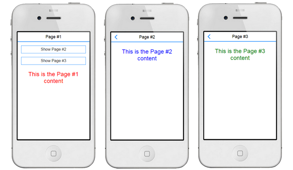

Multi-screen application
========================

Introduction
------------

This code is designed to show how implement a multi-screen template based on a SPA
(Single Page Application) which can be used to create a web technologies based application
such as an Apache Phonegap/Cordova one.

In order to look into different ways to implement this template, I am create three models:

**Raw Javascript**

This model implement events which have just been managed through a clasical Javascript code.

**jQuery Framwork**

So as to improve the development task, for this model I have replaced the raw Javascrip
for functions supplied by jQuery.

**jQuery and KnockoutJS**

Finally, because of I wanted to take advantage of profits provided by a data-binder as
KnockuotJS ( [Oficial web site](http://knockoutjs.com/) ), I have introduced it to
avoid events declaration using jQuery. However, I still needing the jQuery library in
order to operate with some DOM components.

System requirements
-------------------

* jQuery (v1.11.0 or above).
* KnockoutJS (v3.2.0 or above).

How does it work?
-------------

In order to work with multiple screens, I have only created a main wrapper which will contain
the full application GUI. This way, I can lock the size of this layer to fit with the device
screen dimensions.

Once that task is accomplished, I insert the needed quantity of layer which will be my app
screens (for this example, I have just implemented three screens: the main one and other
two auxiliary ones).

In all models, the procedure to rotate screens is always the same.

A set of CSS style rules are decared using *classes names*, so this way, each class defines the
behaviour of the screen which each class has been assigned.

When we want to change the current shown screen, either by raw javascript, jQuery or jQuery and
KnockoutJS, the procedure is the same: 

Firstly, we remove the class which allows to the shown screen to be visible and add to it the needed 
style rule to move the screen on the left or on the right depending on what screen is been displayed.

Then, we remove the class which keep hidden the screen which is gonna be shown and add to it the needed
style rule to move this screen to the visible area on the mobile device.

Finally, if you want to watch how it works, you can check the next link: [Showing Video](http://youtu.be/f0L7OZ_Vrmo).